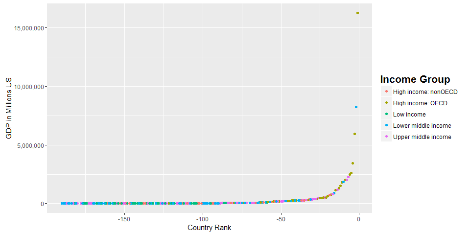

# Case Study Write Up
Joseph Cook  
November 2, 2016  

#Introduction
This analysis of 2012 GDP data combined with 2012 education rankings shows the relationship between GDP and the income group from the education rankings.  The first step that will be shown is how to clean and merge the data in R. Then an analysis will provide the results of the two data sets and show their relationship.

##Collecting and Merging the data

```r
#First we need to load the repmis package to gain access to the stored data
#load repmis package
library(repmis)

### Loading and Cleaning the GDP data
#loading the 2012 GDP raw data
GDP <- source_data("https://d396qusza40orc.cloudfront.net/getdata%2Fdata%2FGDP.csv")
```

```
## Downloading data from: https://d396qusza40orc.cloudfront.net/getdata%2Fdata%2FGDP.csv
```

```
## SHA-1 hash of the downloaded data file is:
## 18dd2f9ca509a8ace7d8de3831a8f842124c533d
```

```
## Warning in fread(data, sep = sep, header = header, data.table = F,
## stringsAsFactors = stringsAsFactors, : Bumped column 6 to type character
## on data row 66, field contains 'a'. Coercing previously read values in this
## column from logical, integer or numeric back to character which may not
## be lossless; e.g., if '00' and '000' occurred before they will now be just
## '0', and there may be inconsistencies with treatment of ',,' and ',NA,' too
## (if they occurred in this column before the bump). If this matters please
## rerun and set 'colClasses' to 'character' for this column. Please note
## that column type detection uses the first 5 rows, the middle 5 rows and the
## last 5 rows, so hopefully this message should be very rare. If reporting to
## datatable-help, please rerun and include the output from verbose=TRUE.
```

```r
#After we have retrieved the data we need to clean up
#subset the data to exclude extra columns
GDP.clean <- GDP[,c(1:2,4:5)]

#rename the columns
colnames(GDP.clean) <- c("CountryCode","GDP.Rank","Country","GDP.in.US.Dollars.2012")

#Subset to remove blank rows and notes
GDP.clean <- GDP.clean[GDP.clean$CountryCode!="",]
GDP.clean <- GDP.clean[GDP.clean$GDP.Rank!="",]

#Change GDP ranking to numeric to allow correct sorting
GDP.clean <- transform(GDP.clean, GDP.Rank = as.numeric(GDP.Rank))

#Change GDP in US dollars to be a number by substituting all the commas out and changing the class to numeric
GDP.clean <- transform(GDP.clean, GDP.in.US.Dollars.2012 = as.numeric(gsub(",","",GDP.in.US.Dollars.2012)))


### Loading and Cleaning the Education data
#loading the 2012 GDP raw data
EduData <- source_data("https://d396qusza40orc.cloudfront.net/getdata%2Fdata%2FEDSTATS_Country.csv")
```

```
## Downloading data from: https://d396qusza40orc.cloudfront.net/getdata%2Fdata%2FEDSTATS_Country.csv
```

```
## SHA-1 hash of the downloaded data file is:
## 20be6ae8245b5a565a815c18a615a83c34745e5e
```

```r
#remove all the rows that are aggregates of incomes and regions
EduData.clean <- EduData[-grep("aggregate",EduData$`Special Notes`),]

#remove the extra columns that are not being used in the analysis
EduData.clean <- EduData.clean[,c(1,3)]

#rename the table to have names that are easier for r to use
names(EduData.clean) <- c("CountryCode","Income.Group")

###### We will now merge the data sets
#Merge the data together
#Do not use all = TRUE.  This will cause to lose the data for the first question
GDP.Edu <- merge(x=GDP.clean, y=EduData.clean,by="CountryCode")
```
##Analysis

```r
#Question 1
#Showing the number of countries that match from the datasets
matches <- nrow(GDP.Edu)
```
The number of country codes that match is: 188.

```r
#Question 2

asc.GDP <- GDP.Edu[order(GDP.Edu$GDP.in.US.Dollars.2012),]
```
St. Kitts and Nevis is the Country with the 13th lowest GDP in the dataset.

```r
#Question 3

High.income.OECD <- GDP.Edu[GDP.Edu$Income.Group=="High income: OECD",]
average.Rank.High.income.OECD <- mean(High.income.OECD$GDP.Rank)
High.income.non.OECD <- GDP.Edu[GDP.Edu$Income.Group=="High income: nonOECD",]
average.Rank.High.income.non.OECD <- mean(High.income.non.OECD$GDP.Rank)
```

The average ranking for high income OECD is 32.97.  The average ranking for high income non OECD is 92.86. As we can see there is a clear difference in the GDP rankings between these groups.  Dispite both being grouped as high income.


```r
#Question 4
#adding additional libraries to plot the GDP data
library(ggplot2)
library(scales)
#Plotted by Rank instead of by Country as it would include all the countries and plot looked a lot cleaner
#interpretion of each data point also makes a lot more sense
ggplot(data=GDP.Edu, aes(x=-GDP.Rank,y=GDP.in.US.Dollars.2012, color = factor(Income.Group)))+ geom_point()+ labs(x="Country Rank",y="GDP in Millions US") + theme(legend.title = element_text(color = "black", size=16, face="bold")) + scale_color_discrete(name="Income Group") + scale_y_continuous(labels= comma)
```

<!-- -->
As we can see from the plot most countries have a very similar GDP.  Only the Top 6 even reach a GDP over over 2.5 trillion US dollars.  There is not significant increase in GDP.  

```r
#Question 5
quintiles <- cut(GDP.Edu$GDP.Rank,breaks=c(0,38.1,76.1,114.1,152.1,190.1),labels= c(1,2,3,4,5))
GDP.Edu$Group <- as.character(quintiles)
GDP.lower.middle.income.1 <- GDP.Edu[GDP.Edu$Income.Group=="Lower middle income" & GDP.Edu$Group=="1",]
```
Of the 38 highest ranked countries 5 are lower middle income Countries.
